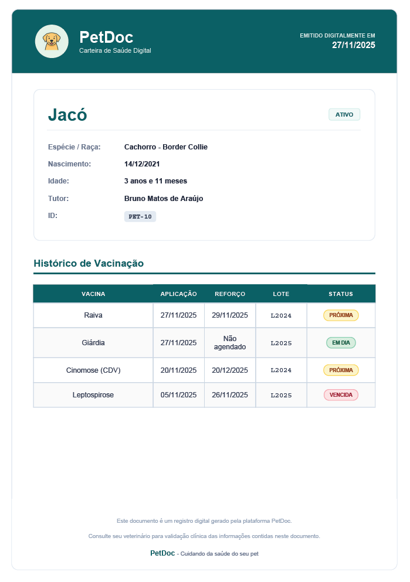
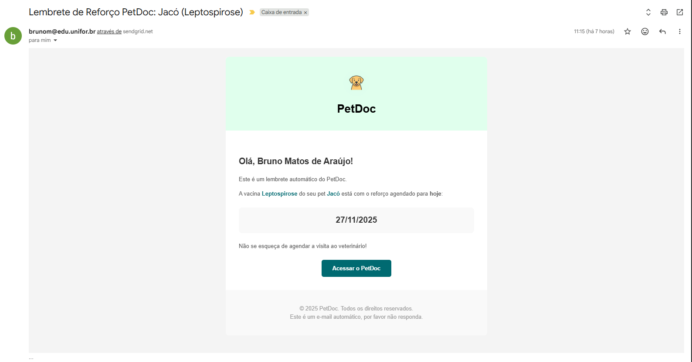
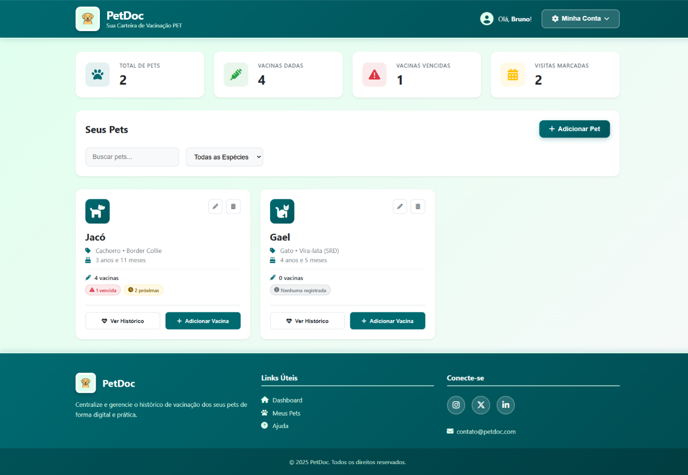
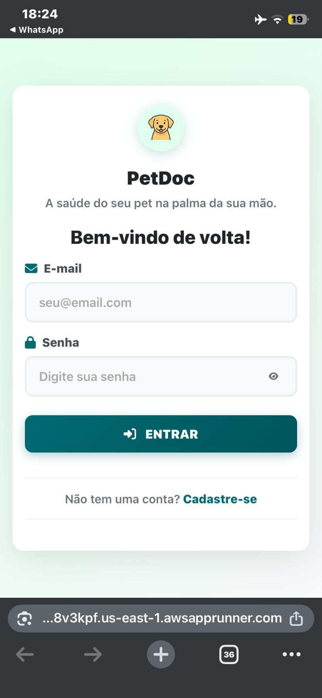
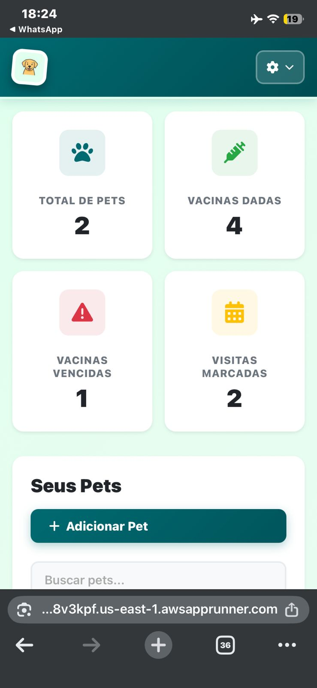
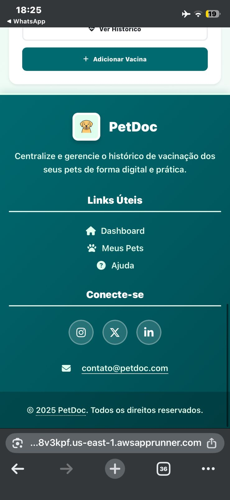
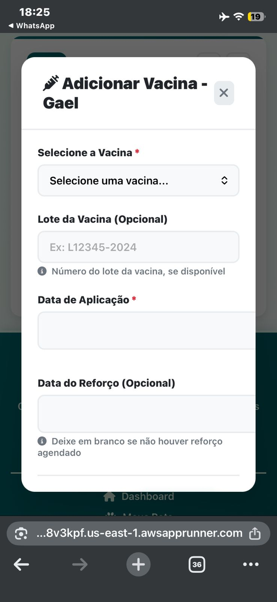
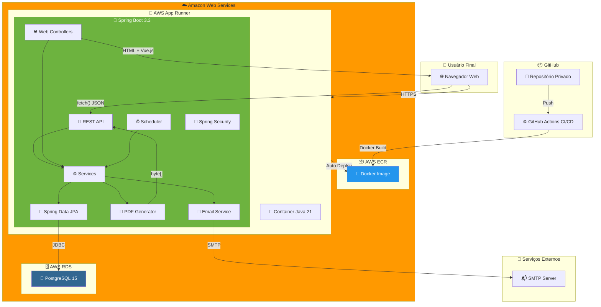
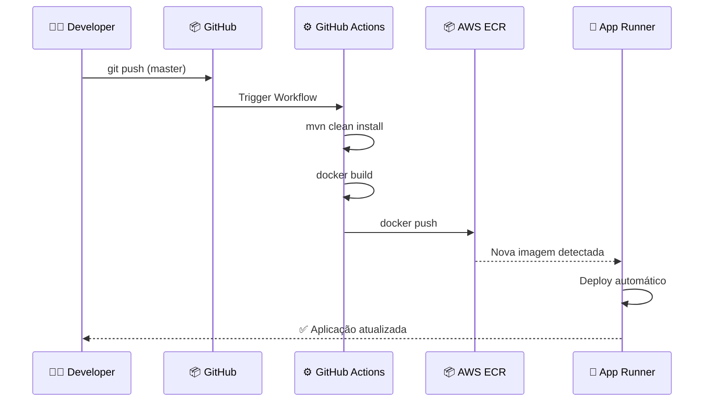
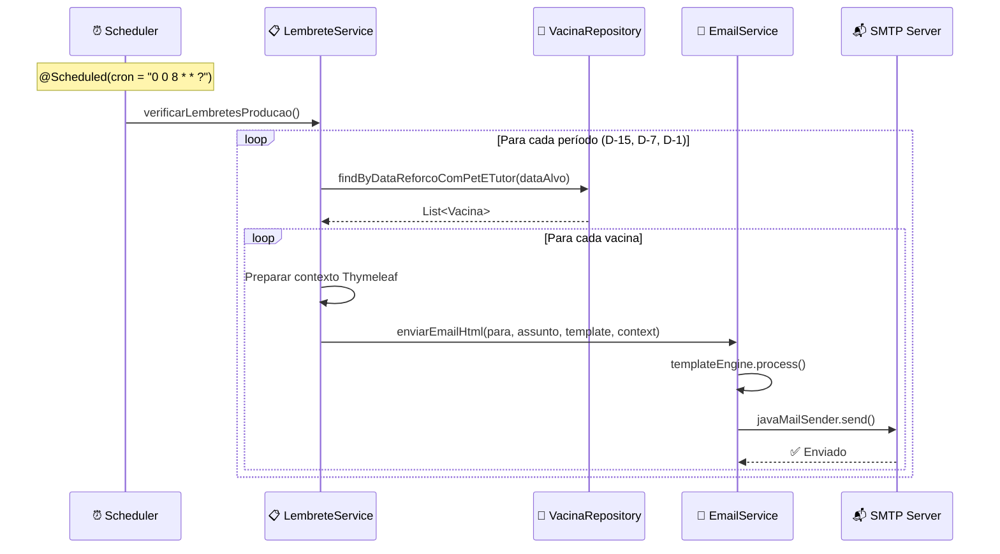

# 🐾 PetDoc - Plataforma SaaS de Gestão Veterinária

**Plataforma completa para gestão de carteiras de vacinação de pets com geração de documentos, lembretes automáticos e deploy contínuo na AWS.**

[🌐 Demo Online](https://6dfs8v3kpf.us-east-1.awsapprunner.com/login) • [📖 Documentação Técnica](#-stack-tecnológica) • [🎯 Roadmap 2026](#-roadmap-2026)

---

## 📋 Visão Geral

O **PetDoc** é um MVP de plataforma SaaS desenvolvido com **Java 21** e **Spring Boot 3.3**, demonstrando proficiência em:

- 🔄 **Arquitetura Full-Stack** com API REST + Frontend Vue.js SPA
- 📄 **Geração de Documentos PDF** dinâmicos com OpenHTMLToPDF
- 📧 **Integração SMTP** com templates HTML e agendamento automático
- ☁️ **Deploy Contínuo** na AWS com Docker e GitHub Actions
- 🔐 **Segurança** com Spring Security (Session-based + CSRF)

> **⚠️ Nota:** Este repositório é uma vitrine pública. O código-fonte completo é privado.

---

## 🖼️ GALERIA & EVIDÊNCIAS TÉCNICAS

Esta seção contém **evidências visuais** das funcionalidades implementadas no backend, provando que o sistema vai além de um simples CRUD.

### 📄 1. Geração de Documentos PDF

| Screenshot | Descrição Técnica |
|:----------:|:------------------|
|  | **Carteira de Vacinação Digital em PDF**    ✅ *Implementação do **OpenHTMLToPDF** com Thymeleaf*   ✅ *Manipulação de streams binários (ByteArrayOutputStream)*   ✅ *Renderização de SVG com BatikSVGDrawer*   ✅ *Conversão de imagens para Base64 inline*    📁 Código: [`code_snippets/CarteiraDigitalService.java`](./code_snippets/CarteiraDigitalService.java) |

💡 <strong>O que esse print prova?</strong>

- Capacidade de gerar documentos PDF programaticamente
- Integração de template engine (Thymeleaf) com biblioteca de PDF
- Manipulação de recursos binários e streams em Java
- Conhecimento de conversão de formatos (HTML → PDF, Imagem → Base64)

---

### 📧 2. Integração SMTP com Scheduler Automático

| Screenshot | Descrição Técnica |
|:----------:|:------------------|
|  | **E-mail de Lembrete de Vacina**    ✅ *Integração **Spring Mail** com JavaMailSender*   ✅ *Templates HTML responsivos com Thymeleaf*   ✅ *Agendamento automático com `@Scheduled`*   ✅ *Lembretes em D-15, D-7 e D-1 (produção)*    📁 Código: [`code_snippets/LembreteService.java`](./code_snippets/LembreteService.java) |

💡 <strong>O que esse print prova?</strong>

- Implementação de sistema de notificações por e-mail
- Uso de Scheduler do Spring para tarefas automáticas
- Integração com serviços externos via SMTP
- Templates HTML profissionais com variáveis dinâmicas
- Tratamento diferenciado por ambiente (dev/prod com `@Profile`)

---

### 📊 3. Dashboard & Analytics

| Screenshot | Descrição Técnica |
|:----------:|:------------------|
|  | **Dashboard com KPIs e Grid de Pets**    ✅ *API REST servindo dados para Frontend Vue.js*   ✅ *Cálculo de métricas em tempo real*   ✅ *Filtros dinâmicos por espécie e busca*   ✅ *Contagem de vacinas vencidas e lembretes ativos*    📁 Código: Ver `DashboardApiController.java` no repositório privado |

💡 <strong>O que esse print prova?</strong>

- Desenvolvimento de API REST bem estruturada
- Integração Frontend-Backend com arquitetura moderna
- Cálculo de KPIs com consultas otimizadas ao banco
- Interface reativa com Vue.js consumindo API

---

### 📱 4. Responsividade Mobile

**Interface Responsiva (Mobile First)**  
✅ *SPA com Vue.js 3 responsiva* | ✅ *CSS Grid e Flexbox adaptativo* | ✅ *UX otimizada para touch devices*

| Tela 1 | Tela 2 | Tela 3 | Tela 4 |
|:---:|:---:|:---:|:---:|
|  |  |  |  |

💡 <strong>O que esse print prova?</strong>

- Desenvolvimento frontend responsivo
- Aplicação de princípios Mobile-First
- Componentização de interface com Vue.js
- Preocupação com UX/UI em múltiplos dispositivos

---

## 🏛️ Arquitetura de Solução

### Diagrama de Arquitetura Completo

### Fluxo de Deploy Contínuo

### Fluxo do Scheduler de Lembretes

---

## 💻 Stack Tecnológica

### Backend

| Tecnologia | Versão | Propósito |
|------------|--------|-----------|
| **Java** | 21 (LTS) | Linguagem principal com features modernas (Records, Pattern Matching) |
| **Spring Boot** | 3.3.0 | Framework principal |
| **Spring Security** | 6.x | Autenticação session-based com CSRF |
| **Spring Data JPA** | - | ORM com Hibernate |
| **Spring Mail** | - | Envio de e-mails SMTP |
| **Flyway** | - | Versionamento de banco de dados |
| **OpenHTMLToPDF** | 1.0.10 | Geração de PDFs |
| **Thymeleaf** | - | Templates (HTML + PDF + E-mail) |
| **SpringDoc OpenAPI** | 2.5.0 | Documentação Swagger |
| **PostgreSQL** | 15 | Banco de dados relacional |
| **Lombok** | - | Redução de boilerplate |
| **JaCoCo** | 0.8.11 | Cobertura de testes (mín. 50%) |

### Frontend

| Tecnologia | Versão | Propósito |
|------------|--------|-----------|
| **Vue.js** | 3.5.13 | Framework JavaScript (via CDN) |
| **Font Awesome** | 6.5.2 | Ícones |
| **CSS3** | - | Estilização responsiva |

### DevOps & Infra

| Tecnologia | Propósito |
|------------|-----------|
| **Docker** | Containerização (multi-stage build) |
| **GitHub Actions** | CI/CD Pipeline |
| **AWS App Runner** | PaaS para containers |
| **AWS ECR** | Registro de imagens Docker |
| **AWS RDS** | PostgreSQL gerenciado |

---

## 📂 Código Fonte - Snippets Selecionados

Esta pasta contém trechos de código **reais** do sistema, demonstrando qualidade e boas práticas.

| Arquivo | Descrição | Conceitos Demonstrados |
|---------|-----------|------------------------|
| [`CarteiraDigitalService.java`](./code_snippets/CarteiraDigitalService.java) | Geração de PDF | OpenHTMLToPDF, Streams, Base64, Thymeleaf |
| [`LembreteService.java`](./code_snippets/LembreteService.java) | Scheduler de Lembretes | @Scheduled, @Profile, Spring Mail, Thymeleaf Context |
| [`SecurityConfig.java`](./code_snippets/SecurityConfig.java) | Configuração de Segurança | Spring Security 6, CORS, CSRF, Roles |

---

## 🎯 Roadmap 2026

### Q1 2026 - Evolução do MVP

- [ ] **Multi-tenancy** - Suporte a clínicas veterinárias como organizações
- [ ] **Notificações Push** - Integração com Firebase Cloud Messaging
- [ ] **API Pública** - Documentação OpenAPI para integrações externas
- [ ] **Testes E2E** - Implementação com Playwright/Cypress

### Q2 2026 - Novas Funcionalidades

- [ ] **Agenda de Consultas** - Sistema de agendamento com veterinários
- [ ] **Prontuário Eletrônico** - Histórico médico completo do pet
- [ ] **Integração WhatsApp** - Notificações via WhatsApp Business API
- [ ] **Relatórios Avançados** - Analytics com gráficos interativos

### Q3 2026 - Escalabilidade

- [ ] **Microservices** - Separação do serviço de e-mails e PDFs
- [ ] **Cache Distribuído** - Redis para sessões e cache
- [ ] **CDN** - CloudFront para assets estáticos
- [ ] **Observabilidade** - APM com AWS X-Ray ou Datadog

### Q4 2026 - Monetização

- [ ] **Planos Premium** - Features avançadas por assinatura
- [ ] **Marketplace** - Integração com petshops e clínicas
- [ ] **App Mobile** - PWA ou aplicativo nativo
- [ ] **Internacionalização** - Suporte a múltiplos idiomas

---

## 👨‍💻 Autor

**Bruno Matos** - Desenvolvedor Full Stack

---

**⭐ Se este projeto demonstrou valor, considere deixar uma estrela!**

